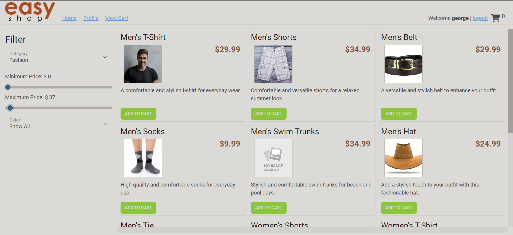
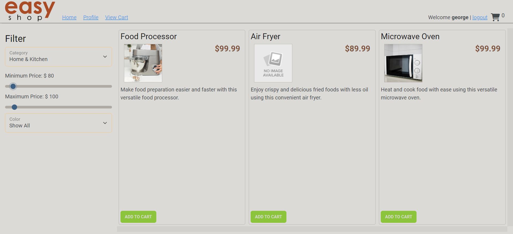
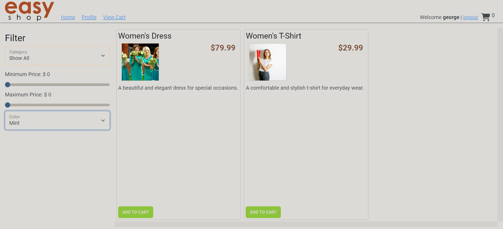
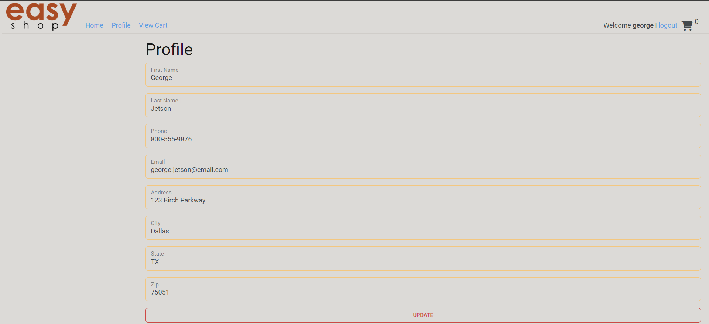
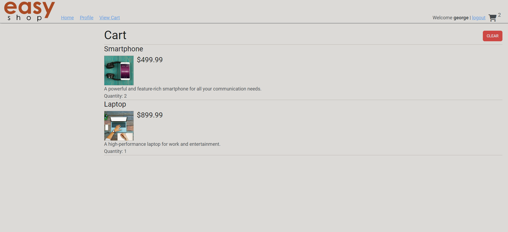

# Capstone 3: EasyShop
For this project, I added new features to and fixed bugs in a pre-existing API that's being used as the back-end of 
a website called "EasyShop".

***During the creation of my application...***
- Something I struggled with was figuring out how everything in the API is connected to one another.
    - I figured out that the easiest way around it was to study the API prior to adding any new code.


***Something I enjoyed while creating my application...***
- Something I enjoyed while creating my application was the problem-solving.

## Screenshots of command line

------------
### User NOT logged in


------------
### User logged in


------------
### Category & Minimum price adjusted


------------
### Category & Maximum price adjusted


------------
### Category, Minimum & Maximum price adjusted


------------
### Color adjusted


------------
### User Profile


------------
### Shopping cart with items


------------
### Shopping cart after clearing cart


------------
***If I was given more time, I would've liked to have worked more on...***
- I would've liked to have worked more on implementing the Checkout feature.

### One interesting piece of code
```java
for(Map.Entry<Integer, ShoppingCartItem> set :
                    shoppingCart.getItems().entrySet())
```
- This was my first time iterating through/over a HashMap, and it worked in unexpected ways.